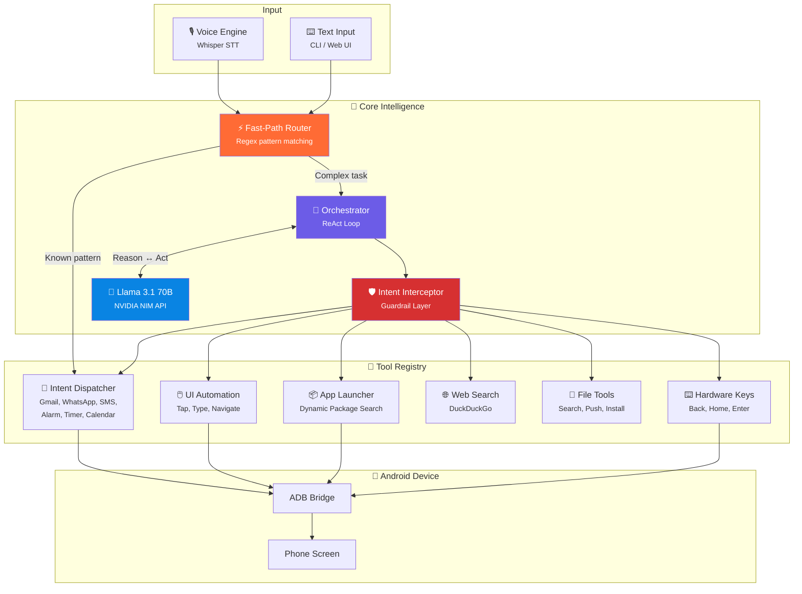
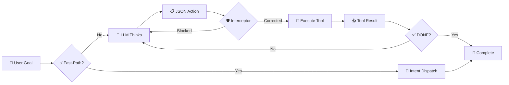
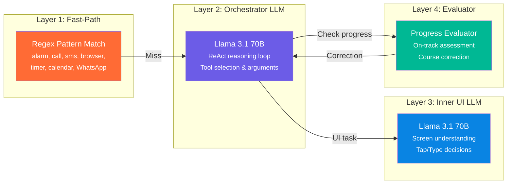
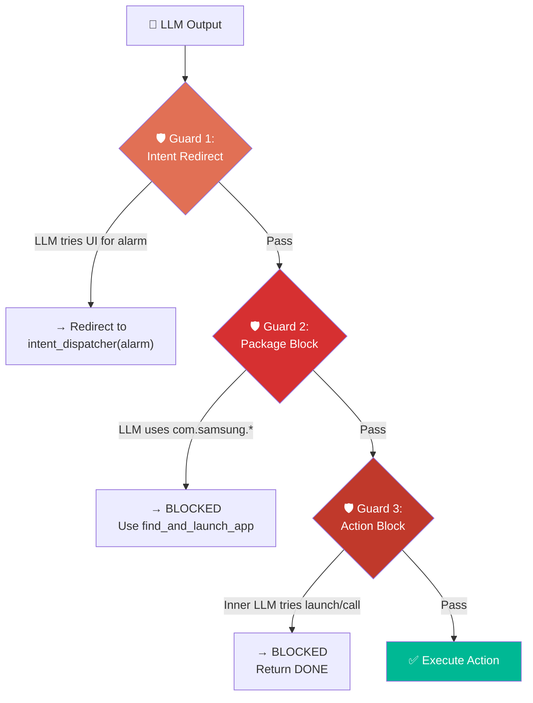
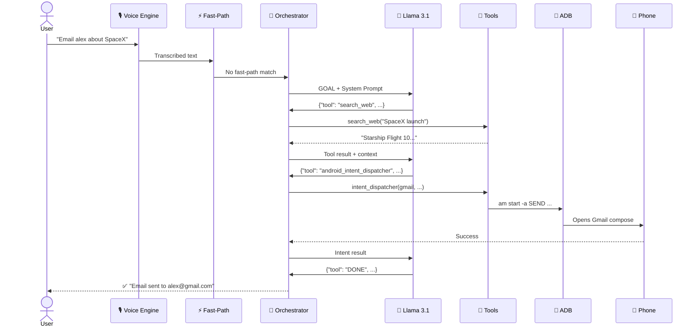

<p align="center">
  
</p>

<h1 align="center">OmniClaw</h1>

<p align="center">
  <strong>An Autonomous General-Intelligence Agent That Controls Your Android Phone</strong>
</p>

<p align="center">
  <em>Speak or type a goal → OmniClaw reasons, plans, and executes it on your phone — hands-free.</em>
</p>

<p align="center">
  <a href="#features"></a>
  <a href="#architecture"></a>
  <a href="https://github.com/ASIKKANI/OmniClaw/blob/main/LICENSE"></a>
  
  
  
  
  
</p>

---

## 🎯 What Is OmniClaw?

OmniClaw is an **autonomous AI agent** that takes a natural-language goal — spoken or typed — and executes it on a connected Android device. It combines **LLM reasoning** (Llama 3.1 70B via NVIDIA NIM), **Android Debug Bridge** control, **voice input** (Whisper), and a **real-time web dashboard** into a single system that can:

- 📧 Draft and send emails with real-time web research
- 📞 Make phone calls and send WhatsApp/SMS messages
- ⏰ Set alarms, timers, and calendar events
- 🌐 Open URLs and search the web
- 📱 Navigate any Android app through UI automation
- 🔍 Find, install, and launch apps dynamically
- 📎 Locate local files and push them to the phone

> **Think Siri + Jarvis** — but open-source, running locally, and powered by a 70B-parameter LLM.

---

## 🧪 Demo

| Voice Command | What Happens |
|---|---|
| *"Email alex@gmail.com about the latest SpaceX launch"* | Searches the web → drafts email with real data → opens Gmail with fields pre-filled |
| *"Set an alarm for 7:30 AM"* | **Fast-path**: instant intent dispatch, no LLM needed (< 1 second) |
| *"Send 100rs to Yeswanth on FamPay"* | Launches FamPay → navigates UI → finds contact → enters amount |
| *"Open the calculator and compute 500 × 2"* | Dynamically finds calculator package → launches → taps buttons → reads result |

---

## ✨ Features

### ⚡ Three Execution Tiers

| Tier | Speed | When |
|---|---|---|
| **Fast-Path** | < 1s | Alarms, calls, SMS, browser, calendar — bypasses LLM entirely |
| **Intent Dispatch** | ~2s | Gmail, WhatsApp, dialer, timer — fires raw Android intents via ADB |
| **LLM + UI Automation** | 10–60s | Complex tasks requiring multi-step reasoning and screen interaction |

### 🛡️ Multi-Layer Safety

- **Fast-Path Router** — intercepts known patterns before the LLM even runs
- **Intent Interceptor** — code-level guardrail that corrects the LLM if it tries to launch apps that have dedicated intents
- **Action Blocker** — blocks the inner LLM from executing forbidden actions (launch, call, open_url)
- **State-Hash Anti-Loop** — detects unchanged screens and prevents infinite loops
- **Action Deduplication** — prevents repeated identical actions

### 🎙️ Dual Input Modes

- **Voice** — local Whisper transcription (base.en model, CPU, int8)
- **Text** — CLI or web UI

---

## 🏗️ Architecture



---

## 🔄 ReAct Loop

The orchestrator follows a **Reason + Act** cycle until the goal is achieved or the iteration limit is reached:



Each LLM step outputs a structured JSON action:

```json
{
  "thought": "I need SpaceX info. Rule 5: search_web first.",
  "tool": "search_web",
  "arguments": {"query": "latest SpaceX launch news 2026"}
}
```

---

## 📁 Project Structure

```
OmniClaw/
├── main.py              # 🚀 CLI entry point (voice + text modes)
├── server.py            # 🌐 Flask web server with SSE streaming
├── orchestrator.py      # 🧠 ReAct loop, fast-path router, intent interceptor
├── llm_router.py        # 🤖 LLM integration (Llama 3.1 70B via NVIDIA NIM)
├── tools.py             # 🔧 9 tools: intents, UI automation, file ops, web search
├── adb_utils.py         # 📱 ADB command wrappers (tap, type, dump UI, keys)
├── voice_engine.py      # 🎙️ Whisper-based speech-to-text
├── web_utils.py         # 🌐 DuckDuckGo search + page scraping
├── index.html           # 🎨 Web dashboard (single-file, real-time SSE)
├── requirements.txt     # 📦 Python dependencies
└── .env                 # 🔑 API keys (not committed)
```

---

## 🚀 Quick Start

### Prerequisites

| Requirement | Details |
|---|---|
| **Python** | 3.10+ |
| **ADB** | [Platform Tools](https://developer.android.com/tools/releases/platform-tools) installed and in PATH |
| **Android Device** | Connected via USB with USB Debugging enabled |
| **NVIDIA NIM API Key** | [Get one here](https://build.nvidia.com/) (free tier available) |

### 1. Clone & Install

```bash
git clone https://github.com/ASIKKANI/OmniClaw.git
cd OmniClaw
pip install -r requirements.txt
```

### 2. Configure

Create a `.env` file in the project root:

```env
NVIDIA_API_KEY=nvapi-your-key-here

# Optional overrides
LLAMA_MODEL=meta/llama-3.1-70b-instruct
LLAMA_BASE_URL=https://integrate.api.nvidia.com/v1
```

### 3. Connect Your Phone

```bash
adb devices   # Verify your device appears
```

> Enable **USB Debugging** in Developer Options on your Android device.

### 4. Run

**Web UI** (recommended):
```bash
python server.py
# Open http://localhost:5000
```

**CLI — Voice Mode**:
```bash
python main.py
# Speak your command, silence stops recording
```

**CLI — Text Mode**:
```bash
python main.py --text
# Type your goal and press Enter
```

---

## 🔧 Tools Reference

| # | Tool | Description | Speed |
|---|---|---|---|
| 1 | `android_intent_dispatcher` | Fire Android intents (Gmail, WhatsApp, browser, alarm, timer, calendar, SMS, call) | ⚡ Instant |
| 2 | `find_and_launch_app` | Dynamically search device packages and launch by common name | 🏃 Fast |
| 3 | `press_hardware_key` | Press BACK, HOME, ENTER, TAB, RECENT_APPS | ⚡ Instant |
| 4 | `execute_android_ui_task` | LLM-driven UI automation with anti-loop protection | 🐢 Slow |
| 5 | `search_web` | Search DuckDuckGo for real-time information | 🏃 Fast |
| 6 | `search_local_file` | Find files on the local PC (Desktop, Documents, Downloads) | 🏃 Fast |
| 7 | `adb_push_file` | Push a local file to the Android device | 🏃 Fast |
| 8 | `adb_check_app` | Check if a package is installed on the device | ⚡ Instant |
| 9 | `adb_install_app` | Install an APK on the device | 🐢 Slow |

---

## 🧠 Intelligence Layers



| Layer | Role | Model |
|---|---|---|
| **Fast-Path** | Instant intent dispatch for known patterns | None (regex) |
| **Orchestrator** | Strategic reasoning, tool selection | Llama 3.1 70B |
| **UI Agent** | Screen reading, tap/type decisions | Llama 3.1 70B |
| **Evaluator** | Progress assessment, course correction | Llama 3.1 70B |

---

## 🛡️ Guardrail System

OmniClaw has **three independent layers** preventing the LLM from going off-track:



---

## 🌐 Web Dashboard

The web UI provides a **real-time view** of the agent's thinking process via Server-Sent Events:

- 🎯 Goal display with input bar
- 🧠 Live thought stream (see each ReAct step)
- 🔧 Tool execution with arguments
- 📤 Results from each tool call
- ⏹️ Skip / Stop controls

**Start the dashboard:**
```bash
python server.py
# Navigate to http://localhost:5000
```

---

## 🔑 Environment Variables

| Variable | Required | Default | Description |
|---|---|---|---|
| `NVIDIA_API_KEY` | ✅ | — | NVIDIA NIM API key for Llama 3.1 |
| `LLAMA_API_KEY` | ⚠️ | — | Alternative to NVIDIA_API_KEY |
| `LLAMA_MODEL` | ❌ | `meta/llama-3.1-70b-instruct` | Model identifier |
| `LLAMA_BASE_URL` | ❌ | `https://integrate.api.nvidia.com/v1` | API base URL |

---

## 🧩 How It Works — End to End



---

## 📊 Tech Stack

| Component | Technology |
|---|---|
| **LLM** | Meta Llama 3.1 70B Instruct |
| **LLM API** | NVIDIA NIM (OpenAI-compatible) |
| **Voice** | faster-whisper (CTranslate2 backend) |
| **Device Control** | Android Debug Bridge (ADB) |
| **Web Server** | Flask + Server-Sent Events |
| **Web Research** | DuckDuckGo + BeautifulSoup4 |
| **Language** | Python 3.10+ |

---

## 🤝 Contributing

1. **Fork** the repository
2. **Create** a feature branch (`git checkout -b feature/amazing-feature`)
3. **Commit** your changes (`git commit -m 'Add amazing feature'`)
4. **Push** to the branch (`git push origin feature/amazing-feature`)
5. **Open** a Pull Request

---

## 📜 License

This project is open source and available under the [MIT License](LICENSE).

---

<p align="center">
  <strong>Built with 🦀 by <a href="https://github.com/ASIKKANI">ASIKKANI</a></strong>
  <br/>
  <sub>OmniClaw — One goal. Every action. Fully autonomous.</sub>
</p>
